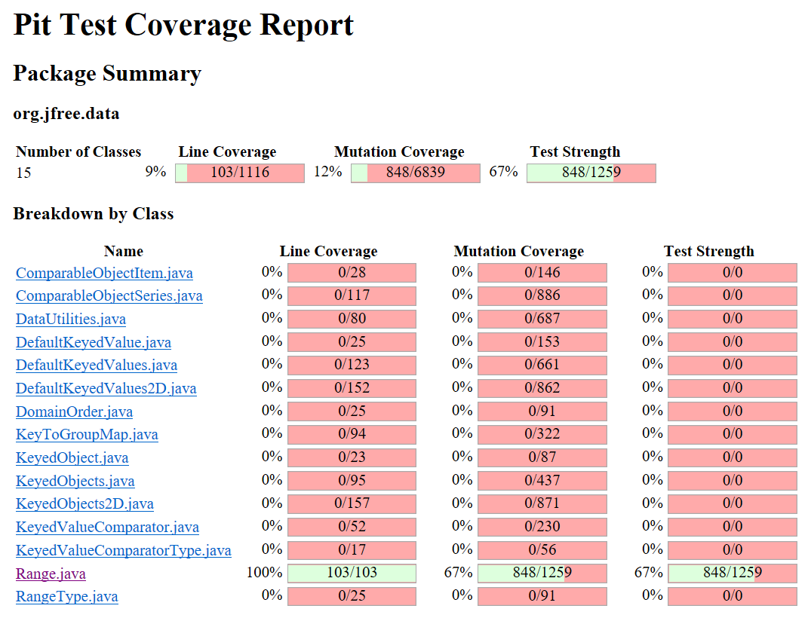
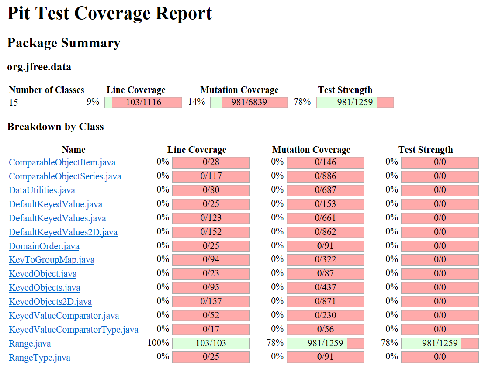

**SENG 438 - Software Testing, Reliability, and Quality**

**Lab. Report \#4 – Mutation Testing and Web app testing**

| Group \#: | 27      |
| --------- | ------- |
| Jared     | Assen   |
| John      | Delsing |
| Ethan     | Kerr    |
| Tyler     | Thain   |

# Introduction

In this lab, our group utilized mutation testing to improve our test suite from assignment 3. Surviving mutants were investigated and killed through updating current tests and adding new tests. Additionally, Selenium was used to briefly test some functionality of Ikea Canada’s home page at https://www.ikea.com/ca/en/.

# Analysis of 10 Mutants of the Range class

#1.  
Function: public boolean contains(double value)  
Line: 144  
Mutation: Changed conditional boundary  
This mutant changes “value >= this.lower” to “value > this.lower”. This mutant survives because our only test for contains checks that 10 is within the range (5, 20). Since 10 is both greater-than and greater-than-or-equal-to 5, the test passes. We don’t have a test on the lower boundary, so we cannot identify this mutant.

#2  
Function: public boolean contains(double value)  
Line: 144  
Mutation: Negated conditional  
This mutant changes “value >= this.lower” to “value < this.lower”. This mutant is killed, because 10 is not less than 5. The entire return statement evaluates to false, which causes our test to fail. This therefore kills the mutant.

#3  
Function: public double constrain(double value)  
Line: 188  
Mutation: Incremented (a++) double local variable number 1.  
This mutant survives, because it postfix increments value. Since it is a postfix increment, the original value of value is stored in result. We do not have any tests where an increment of 1 crosses the boundary from outside to inside the range, or vice versa. When the constrained value is on the lower bound, the lower bound value is saved in “result”. Then “value” gets incremented, and after a failed conditional, “result” gets immediately returned, but it already contained the value we expected. Similarly, when the constrained value is in the middle, “result” gets the expected output, the conditional on line 189 is not triggered, and then “result” is returned. But, again, “result” contains the expected value. Similar logic can be applied to the rest of the test cases.

#4  
Function: public boolean constrain(double value)  
Line: 188  
Mutation: Incremented (++a) double local variable number 1.  
This mutant is killed by our test case. We have a range of (-5.7, 9.1). We send in a constrained value of 2.3. This immediately gets incremented to 3.3, and then stored in “result”. So, we have “result” and “value” equal to 3.3 going into line 189. Since 3.3 is still within the range, the conditional block is skipped, and “result” is returned. However, result contains 3.3, which is not what we expect, so the test fails and the mutant is killed.

#5  
Function: public double constrain(double value)  
Line: 188  
Mutation: Negated double variable 1.  
This mutant is killed. That is because, for one of our tests, we have a constrain value that even when negated is still within the range. Thus “result” is returned immediately on line 197. However, it contains -2.3, not 2.3, and so the wrong result is returned. This fails our test case.

#6  
Function: public static Range scale(Range base, double factor)  
Line: 410  
Mutation: Changed conditional boundary.  
This mutation survives. The condition “factor < 0” is mutated to “factor <= 0”. This mutation is not killed, because we do not have a test where the factor is 0. We therefore cannot discriminate between < and <=.

#7  
Function: public static Range scale(Range base, double factor)  
Line: 410  
Mutation: Negated conditional.  
This mutation is killed. The condition “factor < 0” is mutated to “factor >= 0”. Our test passes in a factor of 2, and 2 >= 0, so it throws an IllegalArgumentException, which fails our test. This kills the mutant.

#8  
Function: public boolean intersects(double b0, double b1)  
Line: 157  
Mutation: Changed conditional boundary.  
This mutation is not killed. The condition “b0 <= this.lower” is mutated to “b0 < this.lower”. This is not killed because we do not have a test where “b0” is the lower boundary of the range. In all of our test cases, b0 < this.lower, so the change to the source code is not caught. If we had a test case where b0 == this.lower and b1 >= this.upper, we would have killed the mutant.

#9  
Function: public boolean intersects(double b0, double b1)  
Line: 157  
Mutation: Negated conditional.  
This mutation is killed. The condition “b0 <= this.lower” is mutated to “b0 > this.lower”. One of our tests has the range of (-10.5, 10.5), b0 = 10.7, and b1 = 13.8. When line 157 is evaluated, the condition is satisfied. Then, on line 158, the function returns true. However, we expect the function to return false, because the ranges do not intersect. Thus the mutant is killed.

#10  
Function: public static Range shift(Range base, double delta, boolean allowZeroCrossing)  
Line: 367  
Mutation: Replaced double addition with multiplication.  
This mutant is killed. The relevant test here has a range of (2, 6). With the mutation, a new Range is constructed whose lower bound is 2 \* 158 = 316, and its upper bound is 164. This throws an exception from the constructor and thus fails the test and kills the mutant.

#11  
Function: public static Range shift(Range base, double delta, boolean allowZeroCrossing)  
Line: 367  
Mutation: Replaced double addition with division.  
This mutant survives. This is because in our tests for this version of the overloaded function, we only check the upper bound. Since this mutation only affects the lower bound of the returned range, and does so in a way that does not cause an exception during construction, we do not catch that the lower bound of the range is incorrect.

#12  
Function: public double getCentralValue()  
Line: 132  
Mutation: Incremented (a++) double field lower.  
This mutant is not killed. This is because the postfix increment of the lower variable occurs in the line that returns a double from the function. The current value of the variable will be used, and then it will be incremented. Thus, the line executes using the current value of this.lower, and so the answer is calculated using the correct value, and so our test detects no difference.

#13  
Function: public double getCentralValue()  
Line: 132  
Mutation: Incremented (++a) double field lower.  
This mutant is killed. This is because the prefix increment takes the current value of this.lower, increments it by one, and then does the calculation in line 132. This results in a different value than the test anticipates, which causes our test case to fail and therefore kill the mutant.

# Report all the statistics and the mutation score for each test class

## DataUtilities

  

## Range

  

# Analysis drawn on the effectiveness of each of the test classes
We were able to meet the goal of increasing our mutation test strength by 10% from 67% to 78%. However, we were only able to improve the mutation score for DataUtilities from 90% to 92% because of equivalent mutants. This shows that our original test suite for DataUtilities was very close to having 100% mutation strength if all equivalent mutants were removed. However, our test suite for Range had lots of room for improvement based on the low mutation test strength. In both cases, many tests ignored certain boundary conditions which allowed for mutants such as starting a loop at 1 instead of 0 to survive. To up our coverage, input data for current tests were changed and new tests needed to be added.

# A discussion on the effect of equivalent mutants on mutation score accuracy

Equivalent mutants hurt the mutation score accuracy of a test suite as they are unkillable by any test. An equivalent mutant will function the exact same as the original code so they should be ignored in mutation testing. Two common equivalent mutants we discovered while testing were postfix operator mutants, (a--) and (a++). When these mutations are done to variables that are not used again in the cose, they have no effect on the final output of the code. For example, in calculateColumnTotal(Values2D data, int column) the line return total is mutated by adding a postfix increment to total. However, since total is returned before it is incremented, the mutation has no effect on the function. Another common equivalent mutant we found was changing < to != in for loops. For example, in calculateColumnTotal(Values2D data, int column), the line, for (int r = 0; r < rowCount; r++) is mutated by changing r < rowCount to r != rowCount. Since r is locally defined as 0 before the conditional check, and rowCount can never be negative, r will always increment up to rowCount in the loop. Therefore, the mutated code acts equivalently to the original function.

We detected mutants manually through investigation of the PIT test mutation summary. While going through the process of killing the initially survived mutants, we discovered some mutants that we could not kill. The first one we noticed was the postfix operators on return values. This intrigued us and we soon noticed that the majority of survived mutants were postfix operator mutants. By looking at patterns in the survived mutants and examining the most common survived mutants, we were able to detect common equivalent mutants.

Automating equivalent mutant detection is a difficult task as equivalence is heavily dependent on the code structure itself. However, some common equivalent mutants should be able to be detected automatically such as the postfix operator mutations on variables that are not used again. If a variable is not used again in a function and it is mutated by postfix incrementing it or decrementing it, the mutation will have no effect on the code output. Therefore, if it is determined that it is the last time a variable is used in the test scope, the postfix, mutants should not be applied to it. To do this, the mutation generating program must be able to detect the last use of a variable which may involve running through the code multiple times, further slowing down an already slow and intensive process.

# A discussion of what could have been done to improve the mutation score of the test suites

To improve the mutation score of our test suite, we followed the PIT test mutation summary to uncover what mutants survived our test suite. We then proceeded to go through each survived mutant one by one, adding and editing tests to kill them. For example in DataUtilities.calculateColumnTotal(Values2D data, int column), in the line, if (n != null), the mutation negated conditional value survived our original test suite. This is because our test suite did not contain a test with a null value in the data table so even if the line was changed to, if(n==null), no value in our test would enter the if in the changed code. Therefore, we added a null value to data in our validInputTest which killed the mutant. We followed a similar process for every survived mutant, first investigating the survived mutant, checking if it was equivalent, and then looking for a way to update an existing test to kill it. If we could not find a test to edit to kill the mutant we added a new test. This allowed us to increase our test strength for Range by 10% but we were unable to increase our test strength for DataUtilities because of equivalent mutants.

# Why do we need mutation testing? Advantages and disadvantages of mutation testing

Mutation testing is advantageous as it tests the actual strength of a test suite. Regardless of coverage, bugs can still get through a test suite so ensuring the strength of the tests allows for more confidence the tests are catching as many bugs as possible. Mutation testing helps improve a test suite allowing testers to write tests capable of catching a variety of different code errors. Additionally, mutation testing also improves code coverage as tests need to become more robust to kill all mutants generated.

However, mutation testing is expensive and time consuming. Even using mutant generators and software like PIT, a lot of resources are required to generate every mutant. Strong programming knowledge and knowledge of the source code is also required to detect equivalent mutants and kill surviving mutants. Additionally, equivalent mutants arbitrarily reduce a test suite's strength so time is required to find and remove equivalent mutants to get an accurate mutation test score.

# Explain your SELENUIM test case design process

The test case design process was best described as exploratory testing. Tests were created based off of functionality of the main web page of Ikea. Each member chose two different functionalities to test that we thought would be important to test. These included the search, cart, wishlist, login, and store location. Each of these are important when visiting the Ikea website as they are common places that a consumer may go. These tests were created after exploring the webpage as an individual and using it as a normal customer would, then writing tests based off of where we ended up, places we commonly visited, or otherwise important functions to the average user.

# Explain the use of assertions and checkpoints

# how did you test each functionaity with different test data

# Discuss advantages and disadvantages of Selenium vs. Sikulix

# How the team work/effort was divided and managed

We split the work evenly among the team, with two members working on the mutations testing for Range, and two members working on DataUtilities. This seemed to split the workload evenly. Also, each member did two Selenium tests for the Ikea website. Additionally, to fill out the lab report, all of the team members met together to work collaboratively on the document. Each member would select a section, and work on it, with edits and additional contributions to each section made by other members. We managed the workload by remaining active in our group chat and communicating with each other often and clearly.

# Difficulties encountered, challenges overcome, and lessons learned

# Comments/feedback on the lab itself
