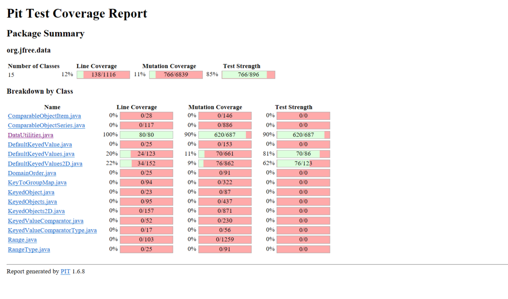
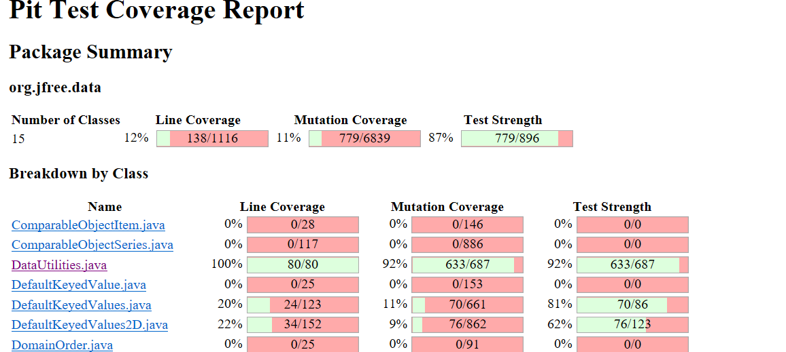

**SENG 438 - Software Testing, Reliability, and Quality**

**Lab. Report \#4 – Mutation Testing and Web app testing**

| Group \#: | 27      |
| --------- | ------- |
| Jared     | Assen   |
| John      | Delsing |
| Ethan     | Kerr    |
| Tyler     | Thain   |

# Introduction

# Analysis of 10 Mutants of the Range class 

# Report all the statistics and the mutation score for each test class

## DataUtilities 

## Range

# Analysis drawn on the effectiveness of each of the test classes
We were able to meet the goal of increasing our mutation test strength by 10% from 67% to 78%. However, we were only able to improve the mutation score for DataUtilities from 90% to 92% because of equivalent mutants.

# A discussion on the effect of equivalent mutants on mutation score accuracy
Equivalent mutants hurt the mutation score accuracy of a test suite as they are unkillable by any test. An equivalent mutant will function the exact same as the original code so they should be ignored in mutation testing. Two common equivalent mutants we discovered while testing were postfix operator mutants, (a--) and (a++). When these mutations are done to variables that are not used again in the cose, they have no effect on the final output of the code. For example, in calculateColumnTotal(Values2D data, int column) the line return total is mutated by adding a postfix increment to total. However, since total is returned before it is incremented, the mutation has no effect on the function. Another common equivalent mutant we found was changing < to != in for loops. For example, in calculateColumnTotal(Values2D data, int column), the line, for (int r = 0; r < rowCount; r++) is mutated by changing r < rowCount to r != rowCount. Since r is locally defined as 0 before the conditional check, and rowCount can never be negative, r will always increment up to rowCount in the loop. Therefore, the mutated code acts equivalently to the original function. 

We detected mutants manually through investigation of the PIT test mutation summary. While going through the process of killing the initially survived mutants, we discovered some mutants that we could not kill. The first one we noticed was the postfix operators on return values. This intrigued us and we soon noticed that the majority of survived mutants were postfix operator mutants. By looking at patterns in the survived mutants and examining the most common survived mutants, we were able to detect common equivalent mutants.  

Automating equivalent mutant detection is a difficult task as equivalence is heavily dependent on the code structure itself. However, some common equivalent mutants should be able to be detected automatically such as the postfix operator mutations on variables that are not used again. If a variable is not used again in a function and it is mutated by postfix incrementing it or decrementing it, the mutation will have no effect on the code output. Therefore, if it is determined that it is the last time a variable is used in the test scope, the postfix, mutants should not be applied to it. To do this, the mutation generating program must be able to detect the last use of a variable which may involve running through the code multiple times, further slowing down an already slow and intensive process.

# A discussion of what could have been done to improve the mutation score of the test suites
To improve the mutation score of our test suite, we followed the PIT test mutation summary to uncover what mutants survived our test suite. We then proceeded to go through each survived mutant one by one, adding and editing tests to kill them. For example in DataUtilities.calculateColumnTotal(Values2D data, int column), in the line, if (n != null), the mutation negated conditional value survived our original test suite. This is because our test suite did not contain a test with a null value in the data table so even if the line was changed to, if(n==null), no value in our test would enter the if in the changed code. Therefore, we added a null value to data in our validInputTest which killed the mutant. We followed a similar process for every survived mutant, first investigating the survived mutant, checking if it was equivalent, and then looking for a way to update an existing test to kill it. If we could not find a test to edit to kill the mutant we added a new test. This allowed us to increase our test strength for Range by 10% but we were unable to increase our test strength for DataUtilities because of equivalent mutants.

# Why do we need mutation testing? Advantages and disadvantages of mutation testing
Mutation testing is advantageous as it tests the actual strength of a test suite. Regardless of coverage, bugs can still get through a test suite so ensuring the strength of the tests allows for more confidence the tests are catching as many bugs as possible. Mutation testing helps improve a test suite allowing testers to write tests capable of catching a variety of different code errors. 

However, mutation testing is expensive and time consuming. Even using mutant generators and software like PIT, a lot of resources are required to generate every mutant. Strong programming knowledge and knowledge of the source code is also required to detect equivalent mutants and kill surviving mutants. Additionally, equivalent mutants arbitrarily reduce a test suite's strength so time is required to find and remove equivalent mutants to get an accurate mutation test score. 

# Explain your SELENUIM test case design process

# Explain the use of assertions and checkpoints

# how did you test each functionaity with different test data

# Discuss advantages and disadvantages of Selenium vs. Sikulix

# How the team work/effort was divided and managed

# Difficulties encountered, challenges overcome, and lessons learned

# Comments/feedback on the lab itself
